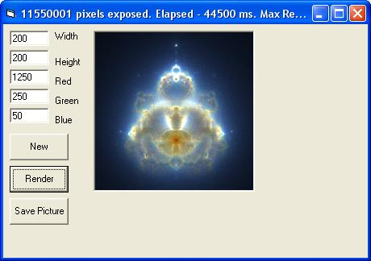



## Buddhabrot fractal Translation

### Description

This is a VB translation to the current Delphi contest winners submission at http://www.planet-source-code.com/vb/scripts/ShowCode.asp?txtCodeId=1684&amp;lngWId=7. I didn't have Delphi but still wanted to try it, description from original author "pseudo colourisation technique. This type of techniques are used by NASA and other space organisation for the astronomical images of distant galaxies, nebulas etc." It basically just makes a colorized version of a mandelbrot set. Updated Jan 11.
 
### More Info
 

             |
---                |---
**Submitted On**   |2006-01-11 09:38:04
**By**             |[Apeiron](https://github.com/Planet-Source-Code/PSCIndex/blob/master/ByAuthor/apeiron.md)
**Level**          |Beginner
**User Rating**    |4.4 (22 globes from 5 users)
**Compatibility**  |VB 6\.0
**Category**       |[Graphics](https://github.com/Planet-Source-Code/PSCIndex/blob/master/ByCategory/graphics__1-46.md)
**World**          |[Visual Basic](https://github.com/Planet-Source-Code/PSCIndex/blob/master/ByWorld/visual-basic.md)
**Archive File**   |[Buddhabrot1964241112006\.zip](https://github.com/Planet-Source-Code/apeiron-buddhabrot-fractal-translation__1-63982/archive/master.zip)

### API Declarations

Setpixel

